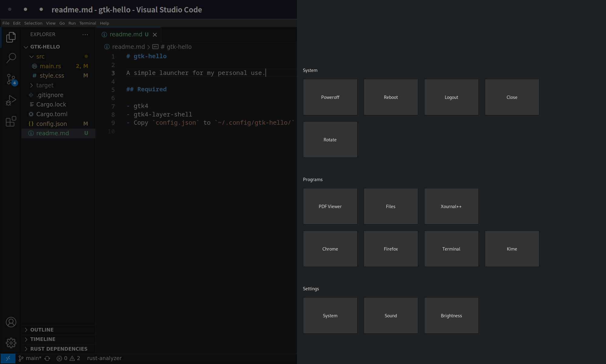

# gtk-hello

A small GTK4 launcher program for my tablet Linux env.



## Required

- gtk4
- gtk4-layer-shell

## Install

```bash
$ cargo build --release
# copy gtk-hello in /usr/local/bin or anywhere you want
$ gtk-hello
```

Copy `config.json` to `~/.config/gtk-hello/` and update it.
